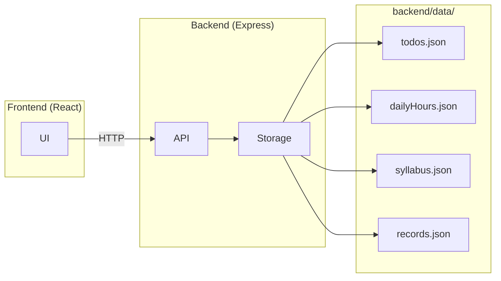
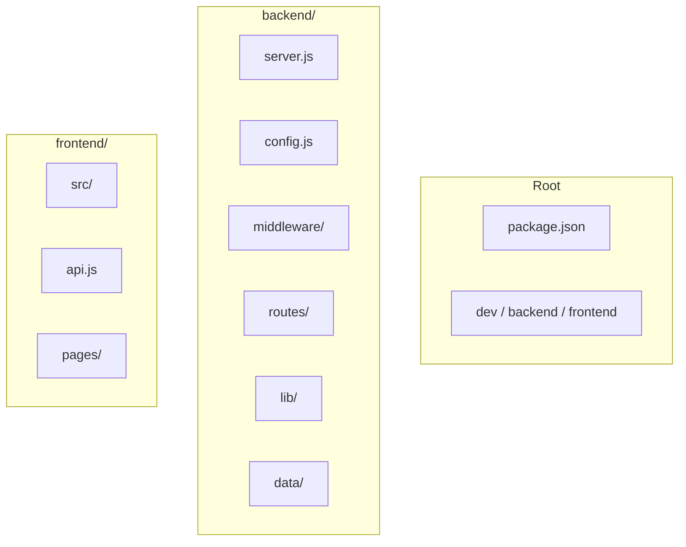

# Career Tracker

A local-first tracker for your UPSC prep: todos, daily streak, study hours, syllabus coverage, routine, and records. All data is stored in **`backend/data/`** as JSON — copy the project folder to another machine and nothing is lost.

## Quick start

```bash
# Install all (root + backend + frontend)
npm run install:all

# Run backend + frontend together
npm run dev
```

- **Backend:** http://localhost:4000  
- **Frontend:** http://localhost:3000 (proxies `/api` to backend)

Or run separately:

```bash
# Terminal 1
npm run backend

# Terminal 2
npm run frontend
```

## Environment variables

| Where | Variable | Default | Description |
|-------|----------|---------|-------------|
| Backend | `NODE_ENV` | `development` | `development` / `production` |
| Backend | `PORT` | `4000` | API server port |
| Frontend | `VITE_API_BASE` | (empty) | Leave empty for dev proxy; set backend URL if not using proxy |

Copy `backend/.env.example` → `backend/.env` and `frontend/.env.example` → `frontend/.env` to override.

## Features

| Feature | Description |
|--------|-------------|
| **Todo** | Add / complete / delete tasks |
| **Streak & hours** | Log study hours per day; current & longest streak |
| **Syllabus** | Prelims + Mains + Optional (Sociology); per-topic completion |
| **Routine** | Weekday/weekend timetable, goals, subject rotation |
| **Records** | Test/mock marks and mistakes |
| **Dashboard** | Today/week goals, streak, coverage %, week report PDF |

## Data storage (portable)

All data lives under **`backend/data/`**:



Copy the whole project (including `backend/data/`) to move your data.

## Project structure



- **backend:** Express, helmet, cors, dotenv, central error handler, request validation, file storage in `data/`.
- **frontend:** React (Vite), React Router, env-based API base.

## Standards & practices

- **Backend:** Config via env; helmet for security headers; body size limit; centralized error handler; 404 handler; input validation and sanitization (dates, string length); consistent JSON error responses.
- **Frontend:** API base from `VITE_API_BASE`; structured error from API (message, status, data).
- **Root:** Single-command dev (`npm run dev` via concurrently); `.gitignore` for `node_modules`, `.env`, build output; `.env.example` in backend and frontend.

## Tasks / roadmap

- [x] Todo, streak, hours, syllabus, routine, records, dashboard
- [x] Week report PDF, goals, streak on dashboard
- [x] Env config, error handling, validation, security headers
- [ ] Optional: backup/export `data/` as zip
